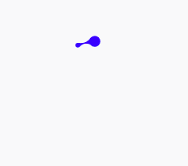

# DxLoadingView

Android loading view




#Useage

layout:

```xml
 <com.dx.dxloadingview.DxLoadingView
        android:id="@+id/loading_view"
        android:layout_width="wrap_content"
        android:layout_height="wrap_content"
        android:layout_gravity="center"
        app:loadingColor="@color/colorPrimary"
        app:animationDuration="2400"
        app:loadingViewSize="large"
        />
```
animationDuration: single circulating animation duration.

start animation:

```java
DxLoadingView loadingView = (DxLoadingView) findViewById(R.id.loading_view);
loadingView.startAnimation();
```

cancel animation:

```java
loadingView.cancelAnimation();
```

idea from:https://www.uplabs.com/posts/liquid-motion-marketing
